# 🏗️ Architecture Documentation
## HVAC AI Adoption Framework - System Design

---

## Table of Contents

1. [System Overview](#system-overview)
2. [Component Architecture](#component-architecture)
3. [Data Flow](#data-flow)
4. [Scoring Engine Design](#scoring-engine-design)
5. [Platform Integration](#platform-integration)
6. [Security & Privacy](#security--privacy)
7. [Scalability Considerations](#scalability-considerations)

---

## System Overview

The HVAC AI Adoption Framework is designed as a modular, platform-agnostic system that enables assessment, design, and implementation of AI pilots in HVAC operations.

### High-Level Architecture

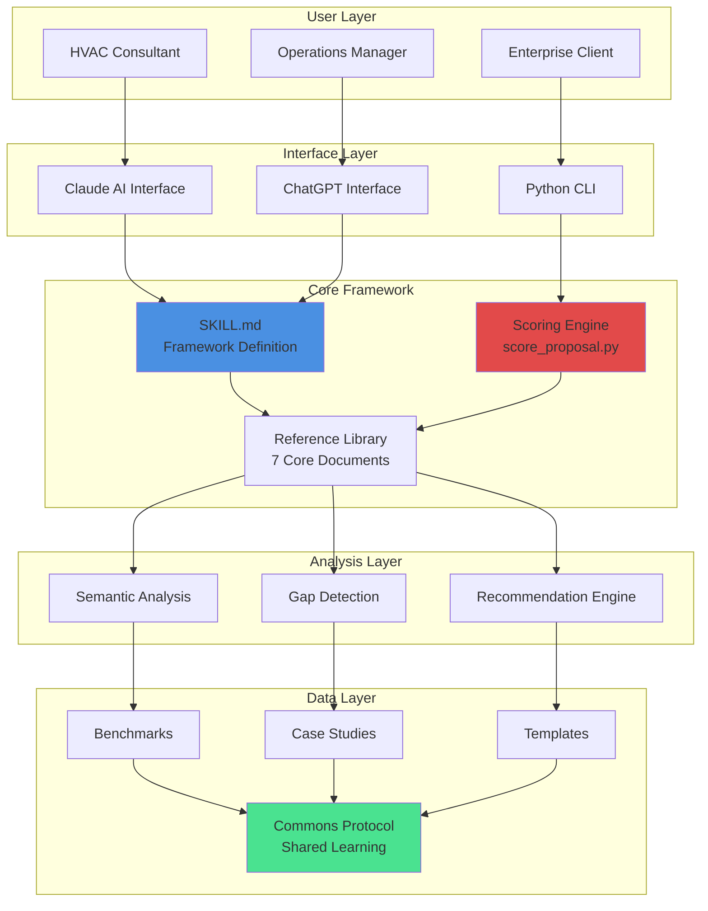

---

## Component Architecture

### Core Components

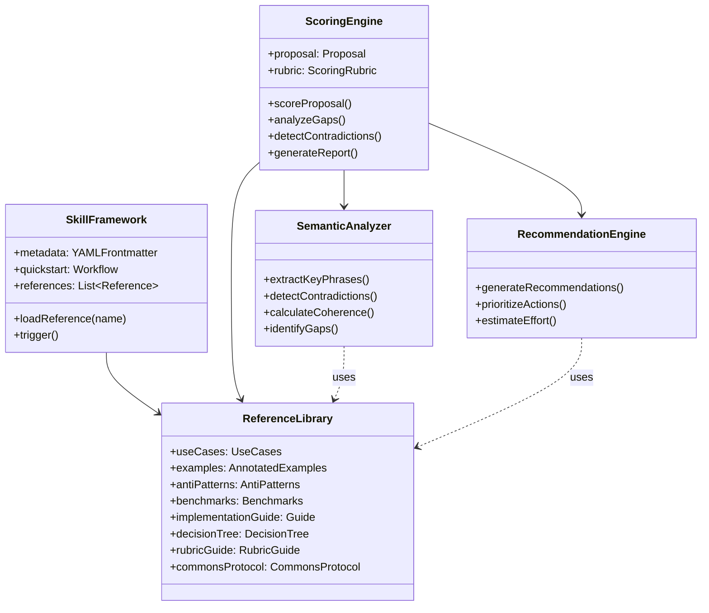

---

## Data Flow

### Assessment to Implementation Flow

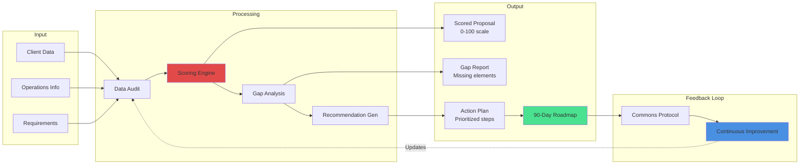

### Scoring Pipeline

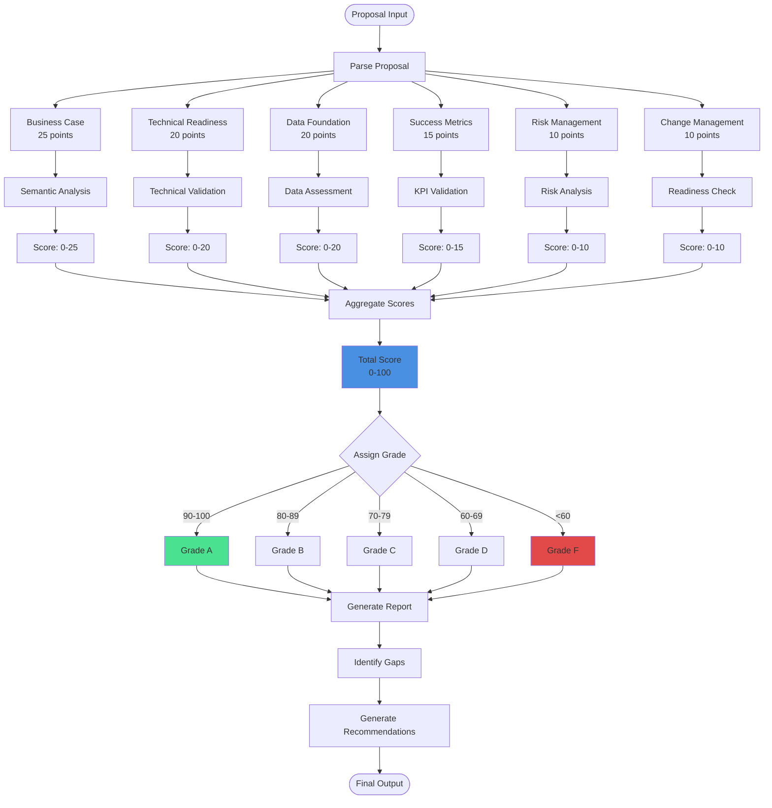

---

## Scoring Engine Design

### Algorithm Overview

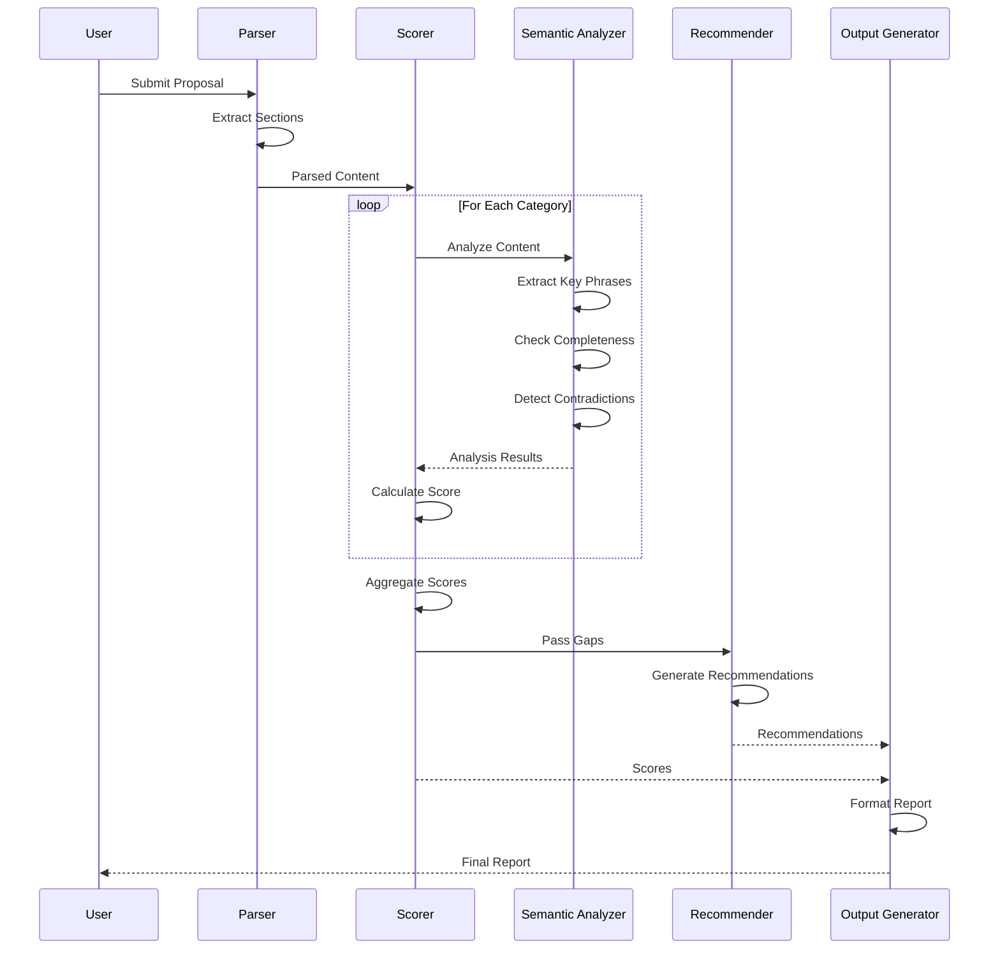

### Semantic Analysis Components

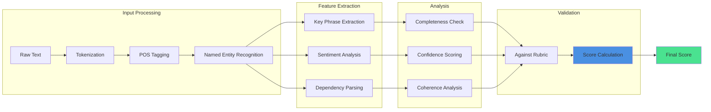

---

## Platform Integration

### Multi-Platform Support

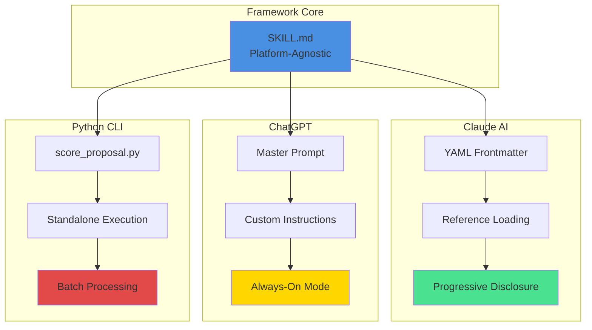

### Claude AI Workflow

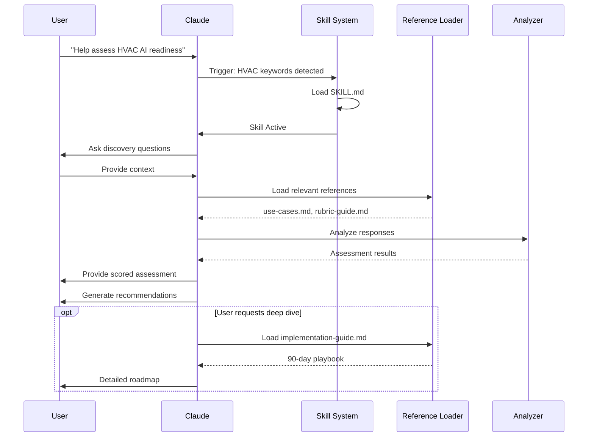

---

## Security & Privacy

### Data Handling Architecture

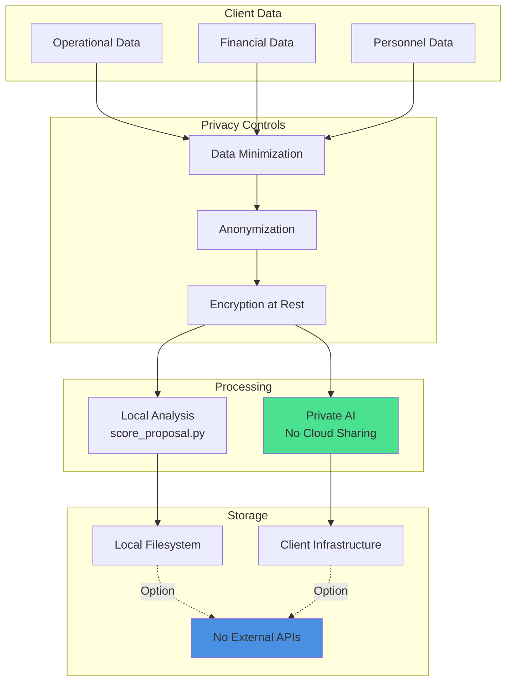

### Private AI Emphasis

**Key Security Principles:**

1. **Data Sovereignty** - Client data never leaves their infrastructure
2. **Offline Capable** - Python tools work without internet
3. **No Training** - Client data not used to train models
4. **Audit Trail** - All processing logged and auditable
5. **Compliance** - GDPR, CCPA, SOC2 compatible

---

## Scalability Considerations

### Scaling Architecture

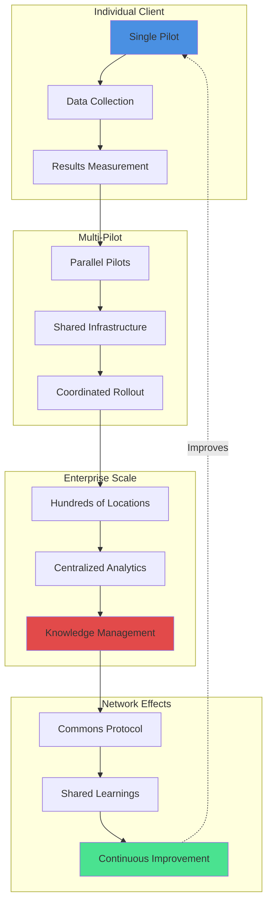

### Performance Characteristics

| Scale | Clients | Pilots | Processing Time | Storage |
|-------|---------|--------|----------------|---------|
| **Small** | 1-5 | 1-10 | <1s per proposal | <100MB |
| **Medium** | 5-25 | 10-50 | <5s per proposal | <1GB |
| **Large** | 25-100 | 50-200 | <30s per proposal | <10GB |
| **Enterprise** | 100+ | 200+ | Batch processing | <100GB |

---

## Technology Stack Details

### Python Scoring Engine

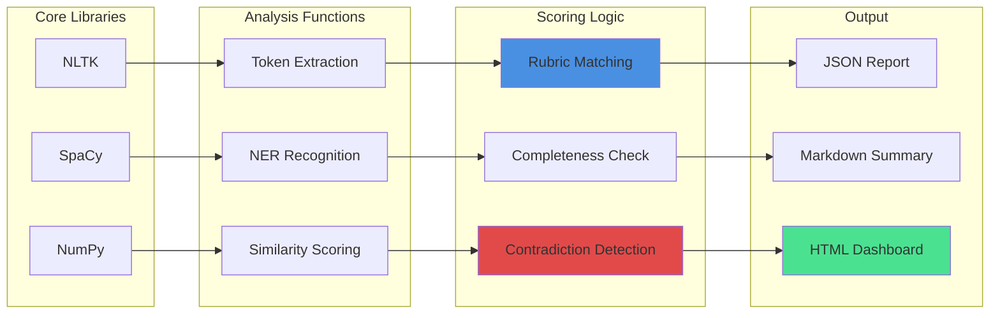

### Dependencies

```python
# Core NLP
nltk==3.8.1              # Tokenization, POS tagging
spacy==3.5.3             # Advanced NLP, NER
en_core_web_sm==3.5.0    # English language model

# Numerical
numpy==1.24.3            # Vector operations
scipy==1.10.1            # Statistical analysis

# Data handling (optional)
pandas==2.0.2            # Data structures
openpyxl==3.1.2         # Excel export

# Visualization (optional)
matplotlib==3.7.1        # Plotting
plotly==5.14.1          # Interactive charts

# Testing
pytest==7.3.1            # Unit testing
pytest-cov==4.1.0       # Coverage reporting
```

---

## Extension Points

### Adding New Features

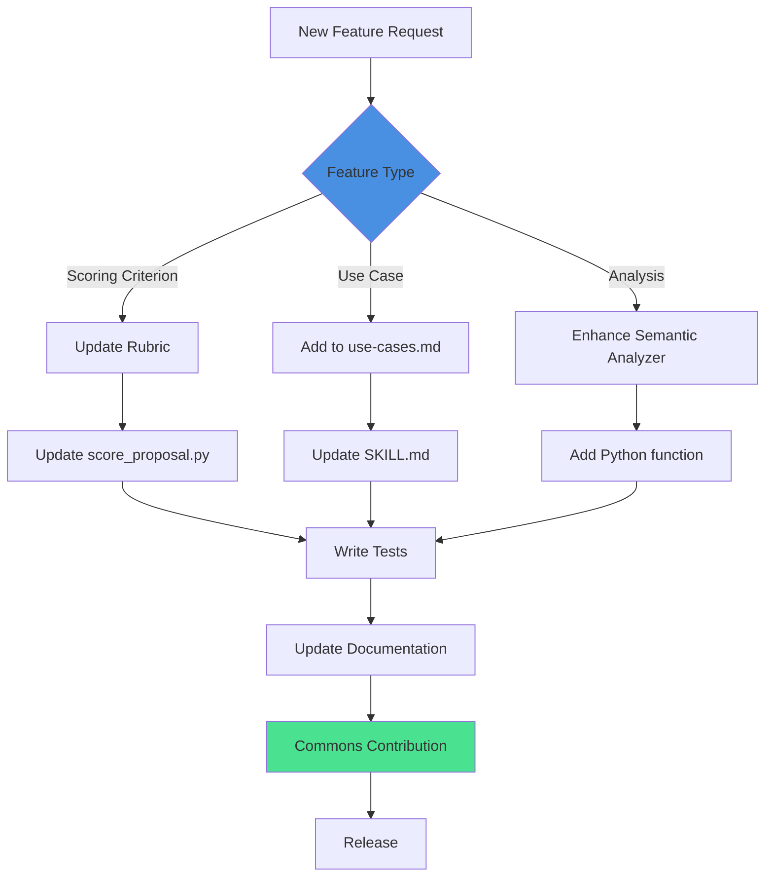

### Plugin Architecture

Future versions will support plugins for:

- Industry-specific scoring criteria
- Custom data integrations
- Third-party analytics platforms
- Specialized reporting formats

---

## Deployment Models

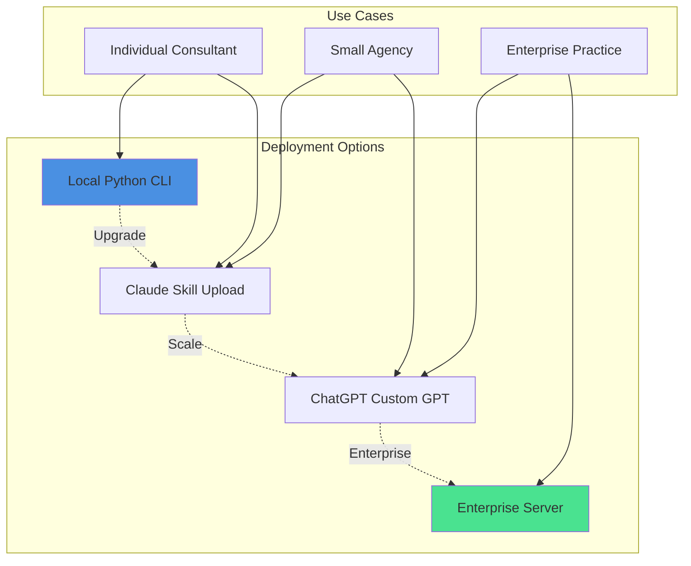

---

## Performance Optimization

### Scoring Engine Optimization

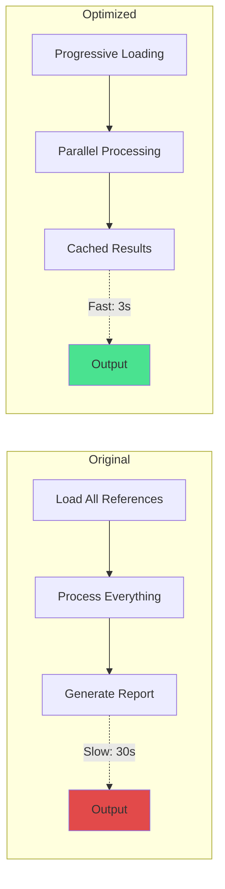

**Optimization Techniques:**

1. **Lazy Loading** - Load references only when needed
2. **Caching** - Store processed results
3. **Parallel Processing** - Analyze categories simultaneously
4. **Incremental Scoring** - Update scores as data comes in
5. **Index Building** - Pre-index common phrases

---

## Monitoring & Analytics

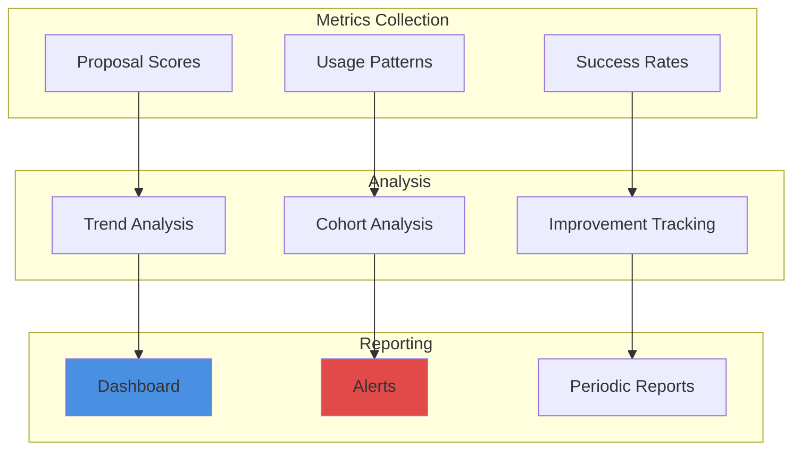

---

## Future Architecture

### Roadmap: Next-Generation System

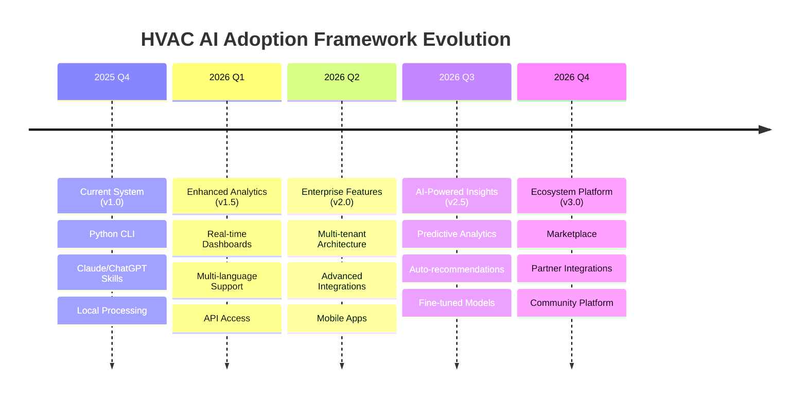

---

## References

- [Main README](../README.md)
- [API Documentation](API.md)
- [Deployment Guide](DEPLOYMENT.md)
- [Contributing Guidelines](../CONTRIBUTING.md)

---

<div align="center">

**Architecture designed for scale, built for simplicity**

[Back to README](../README.md) • [View API Docs](API.md) • [Deployment Guide](DEPLOYMENT.md)

</div>
